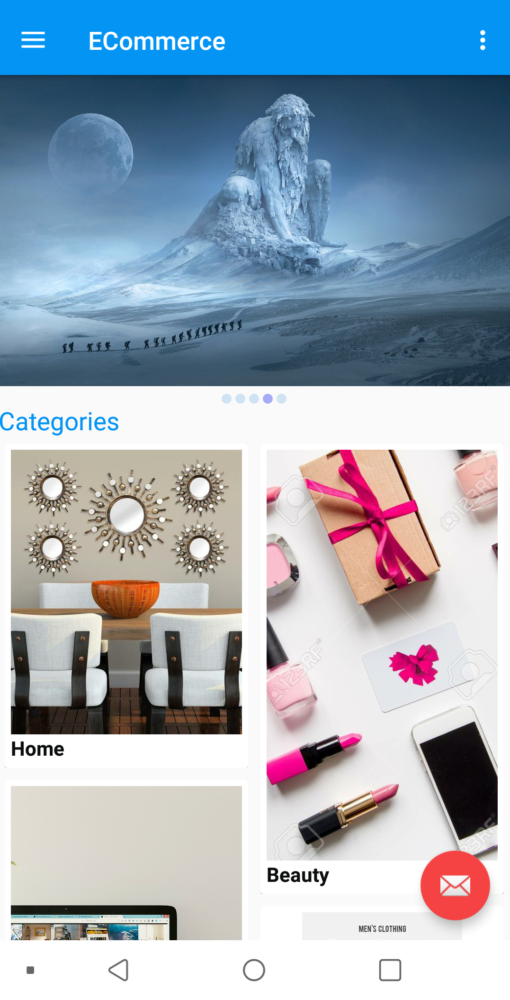
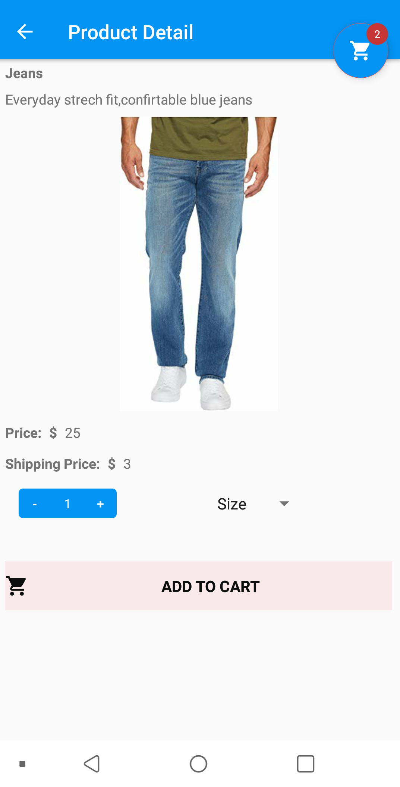
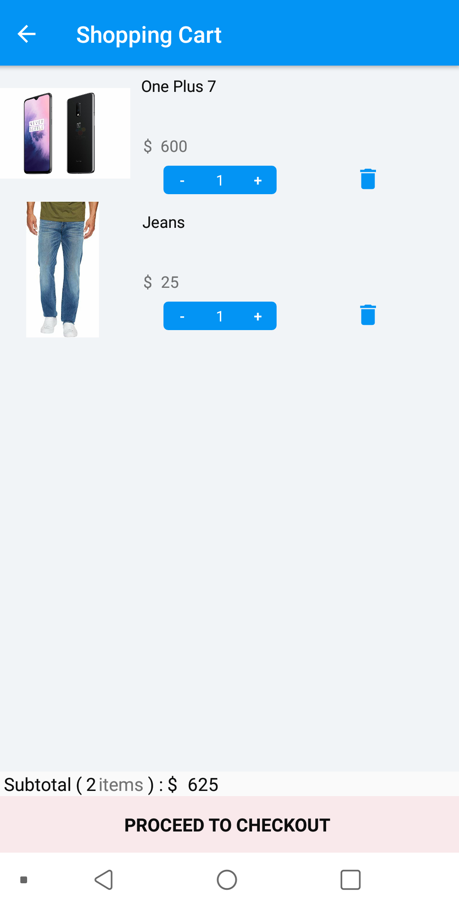
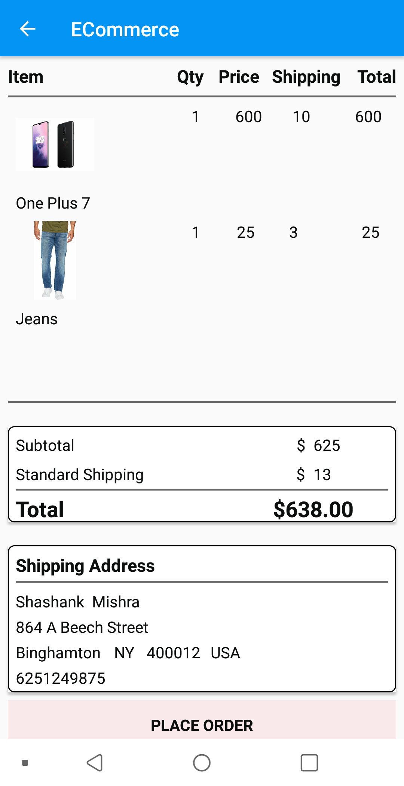
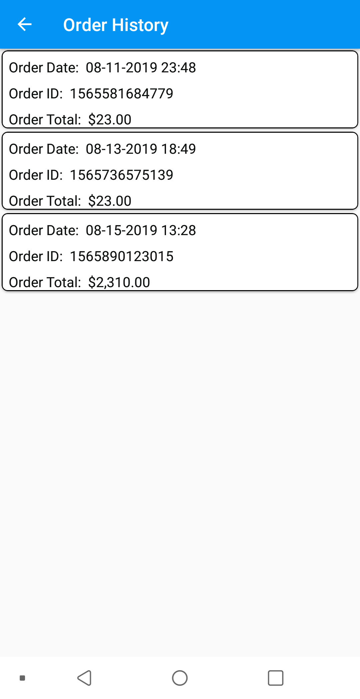

# ECommerce-Android
A generic ECommerce Android application supporting the basic features of an e-commerce website. 
The Application Displays a list of Categories on the Home page 
 
Each Category is fetched at Realtime from Firebase.
When the user selects a category, all the products from that category are displayed. 
User can then select required product to get complete information about it. 
 
The product detail page shows the option of selecting the number of items needed and then adding them to the shopping cart.
User can also see the number of items currently in the cart.
The Shopping cart shows the number of products added to the cart and the toatl price of all the items. 
 
User can change the number of items and and also remove the item from cart.
The Checkout page shows the delivery address and the order total.If the user is placing order for the first time he has to enter the deliver address along with his phone number, which is saved in the firebase database. 
 
The order history page shows the list of orders placed till date, user can click on an order to see the products ordered. 
 
